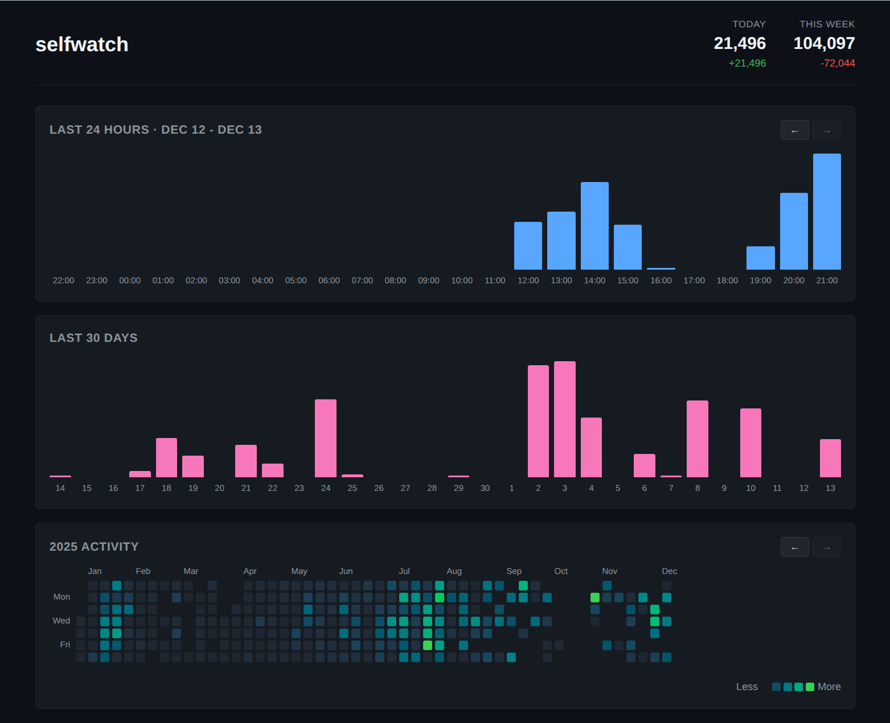

# selfwatch

Selfwatch is a program that monitors how you use your computer. It's inspired
by [selfspy](https://github.com/gurgeh/selfspy). It tracks the number of keys
pressed over time using the X11 RECORD extension on Linux. It comes with a
handy dashboard to visualize your activity.



## Usage

```
> selfwatch --help

Usage of selfwatch:
  -config string
    	Path to json config file (default "selfwatch.json")
```

## Web Mode

Selfwatch includes a built-in web server that provides a dashboard for
visualizing your typing activity. The dashboard displays hourly, daily bar
graphs and a GitHub style contribution grid showing a heatmap for the year.

The web interface doens't start with the record daemon so you aren't leaking
data about your typing just because you are recording.

Start it with:

```
> selfwatch web [address]
```

The default address is `localhost:8080`. You can specify a different address:

```
> selfwatch web localhost:9000
> selfwatch web 0.0.0.0:8080
```

The web interface will use your config file to locate the database to
visualize. The `NewDayHour` will apply to any daily aggregation.

## Config

The following options can be specified in the configuration json file:

* `DbName` - The name of the sqlite database to load to store data (default: `"~/.selfwatch/selfwatch.db"`)
* `RemoteUrl` - A URL to flush key press counts to every `RemoteFlushDelay` seconds. Data is encoded as JSON and sent as a post request. It's formatted as an array of arrays: `[id, "YYYY:DD:MM HH:MM:SS", count]`
* `RemoteFlushDelay` - How long to wait between flushing key counts to remote server, default 60
* `SyncDelay` - How long to buffer key counts in memory before flushing to database (application switches will trigger immediate flush)
* `NewDayHour` - The hour (0-23) when a new day starts for statistics purposes (default: 4). Useful if you work late nights and want activity after midnight counted as part of the previous day

## About

Author: Leaf Corcoran (leafo) ([@moonscript](http://twitter.com/moonscript))  
Email: leafot@gmail.com  
Homepage: <http://leafo.net>  
License: MIT, Copyright (C) 2025 by Leaf Corcoran


